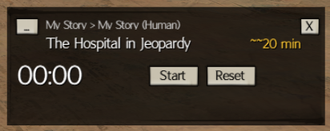
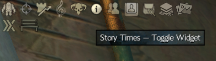
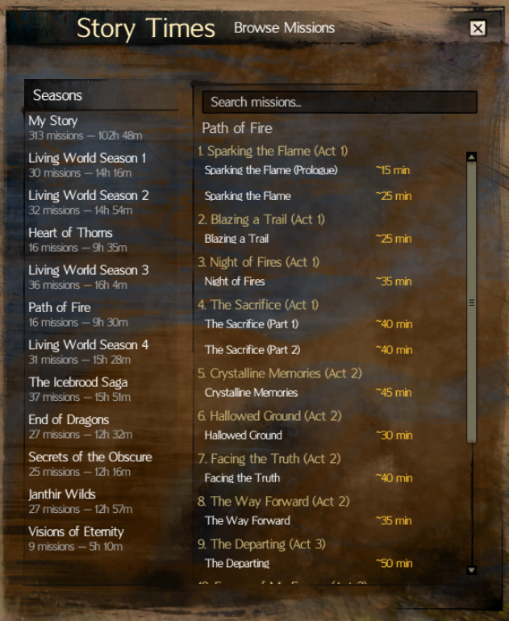
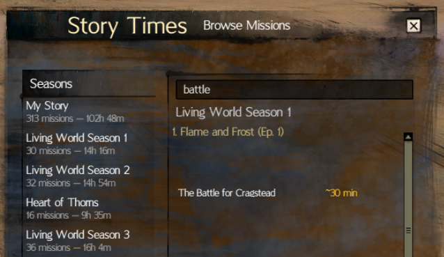
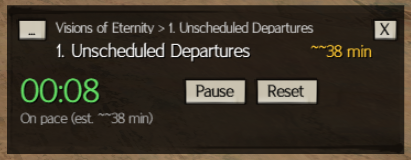
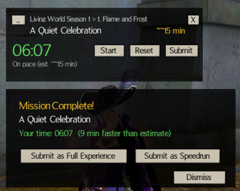

# Story Times BlishHUD Module

A [Blish HUD](https://blishhud.com/) module that brings [GW2 Story Times](https://gw2storytimes.com) into Guild Wars 2. Browse community time estimates for every story mission, time your own runs, and submit your completion times, all without leaving the game.

<!-- TODO: Replace with a screenshot of the widget overlay in-game -->


## Features

- **Compact overlay widget** with mission info, timer, and time estimate
- **Mission browser** covering every story season from My Story through Visions of Eternity
- **Built-in stopwatch** with color-coded pacing feedback
- **One-click time submissions** to the community database
- **Search and filter** missions by name, with automatic race-based filtering for My Story
- **Draggable widget** that remembers its position between sessions
- **Configurable hotkey** to toggle the widget on or off

## Installation

### From the BlishHUD Module Browser (Recommended)

1. Open Blish HUD in Guild Wars 2
2. Go to the **Module** tab in settings
3. Search for **Story Times**
4. Click **Install**

### Manual Installation

1. Download the latest `GW2StoryTimes.bhm` from the [Releases](https://github.com/MattyGroch/gw2-storytimerwidget/releases) page
2. Place the `.bhm` file in your Blish HUD `modules` folder (typically `Documents\Guild Wars 2\addons\blishhud\modules\`)
3. Restart Blish HUD or enable the module from the Module settings tab

## Getting Started

### Opening the Widget

Click the **Story Times** icon in the Blish HUD corner icon bar (top-left menu) to toggle the overlay widget. You can also bind a hotkey in the module settings.

<!-- TODO: Replace with a screenshot showing the corner icon location -->


### Selecting a Mission

When no mission is selected, the widget displays "No mission selected -- (click to browse)". You have two ways to open the mission browser:

1. **Click the "..." button** on the widget
2. **Click the "No mission selected" text** on the widget

<!-- TODO: Replace with a screenshot of the mission browser window -->


The mission browser has two panels:

- **Left panel** -- Lists every story season with mission count and total estimated time
- **Right panel** -- Shows the missions for the selected season, grouped by story chapter or episode

Click any season on the left to load its missions. Then click a mission on the right to select it and close the browser.

### Search and Filtering

Use the **search box** at the top of the mission browser to filter missions by name or story name. Results update as you type.

For **My Story** seasons, the browser automatically detects your active character's race and only shows the relevant story branches. A hint like "Showing quests for Human" appears when filtering is active.

<!-- TODO: Replace with a screenshot showing search filtering in action -->


## Using the Timer

The widget includes a built-in stopwatch to time your mission runs.

<!-- TODO: Replace with a screenshot of the widget while timing a mission -->


| Button | Action |
|--------|--------|
| **Start** | Begin or resume the timer |
| **Pause** | Pause the running timer (button toggles with Start) |
| **Reset** | Reset the timer back to 00:00 |
| **Submit** | Submit your time (appears when the timer is stopped with 30+ seconds elapsed) |
| **X** | Clear the selected mission and reset the timer |

### Color-Coded Pacing

While timing, the timer display changes color based on your pace relative to the community average:

| Color | Meaning |
|-------|---------|
| **Green** | On pace -- under 75% of the estimated time |
| **Yellow** | Approaching -- between 75% and 100% of the estimate |
| **Red** | Over estimate -- you've exceeded the average time |

A status message below the timer shows your current pacing, e.g., "On pace (est. ~25m)" or "Over estimate by ~3 min".

## Submitting Your Time

After stopping the timer (with at least 30 seconds elapsed and a mission selected), a **Submit** button appears on the widget. Clicking it opens a feedback prompt:

<!-- TODO: Replace with a screenshot of the feedback/submission prompt -->


The prompt shows:
- Your completion time
- How you compare to the community average (faster, slower, or right on target)
- Two submission options: **Submit as Full Experience** or **Submit as Speedrun**

Your submission is sent anonymously to the [GW2 Story Times](https://gw2storytimes.com) database to help improve time estimates for the community. You can submit once per mission per category every 24 hours.

## Settings

Access module settings through BlishHUD's **Module** tab in the settings window.

| Setting | Description | Default |
|---------|-------------|---------|
| **Show Feedback Prompt** | Show the submission prompt when you stop the timer | Enabled |
| **Default Submission Type** | Which time category to display (Full vs Speed) and which to default when submitting | Full |
| **Toggle Widget Hotkey** | Keybind to show/hide the Story Times widget overlay | None |

## Moving the Widget

The widget is **draggable**. Click and drag the top portion of the widget (the mission name / breadcrumb area) to reposition it anywhere on screen. The position is saved automatically and persists between sessions.

On first launch, the widget appears centered on screen.

## Data Source

All time estimates come from [gw2storytimes.com](https://gw2storytimes.com), a community-driven database of Guild Wars 2 story mission completion times. Visit the website to browse estimates, view detailed statistics, or contribute times through the web interface.

## Building from Source

### Prerequisites

- [.NET SDK](https://dotnet.microsoft.com/download) (8.0+)
- [.NET Framework 4.8 Developer Pack](https://dotnet.microsoft.com/download/dotnet-framework/net48)

### Build

```bash
dotnet restore
dotnet build -c Release
```

The `.bhm` module package is generated automatically at `GW2StoryTimes/bin/Release/net48/GW2StoryTimes.bhm`.

### Debug

To debug locally, update `GW2StoryTimes/Properties/launchSettings.json` with the path to your Blish HUD installation, then launch from your IDE. The module runs with the `--debug --module` flag.

## Contributing

Contributions are welcome! Please open an issue or pull request on [GitHub](https://github.com/MattyGroch/gw2-storytimerwidget).

## License

This project is open source. See the repository for license details.


